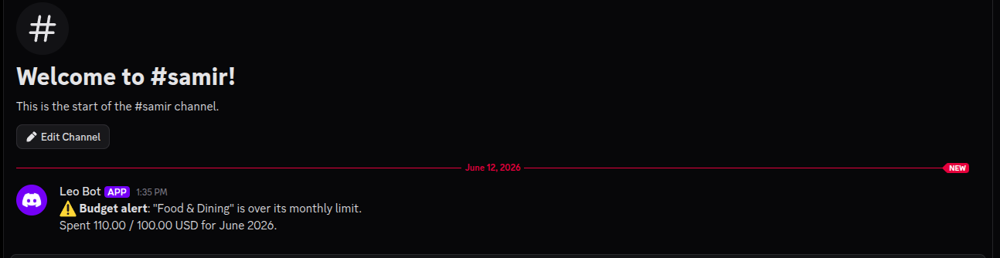

# Expense Tracker API — Intern Screening

A small Django REST Framework backend for tracking personal spending
(categories, expenses, date filtering, and a per-category summary).

## Your Task (read this first)

You will work with this codebase in four stages:

1. **Fix 5 bugs.** The code contains **5 intentional bugs**. Find and fix them
   all. Every hint you need is in the codebase or in this file.
2. **Add Authentication (required).** Scope expenses and categories to the
   logged-in user and protect the endpoints.
3. **Build 2 integration features (required):**
   [Currency conversion](#feature-1--currency-conversion) and
   [Budget threshold bot alerts](#feature-2--budget-threshold-bot-alerts).
   Both are specified in detail below, with example requests/responses — these
   are the hard part.
4. **Add 2 optional features** of your choice ([list below](#optional-pick-any-2)).

Config placeholders for stage 3 are already in `.env.example` — copy them into
your `.env`.

Full rules, branch naming, and submission details are in
[requirements](#full-requirements) at the bottom. Read that **before** writing
code — workflow is graded.

## What you've been given

| File / Dir                 | What it is                                              |
|----------------------------|---------------------------------------------------------|
| `expenses/`                | The app: `models.py`, `serializers.py`, `views.py`, `urls.py`, `tests.py` |
| `config/`                  | Django project settings and root URL config             |
| `postman_collection.json`  | **Ready-to-import Postman collection — every endpoint.** Use it to test and hunt bugs. |
| `.env.example`             | Template for your `.env`                                 |
| `pyproject.toml`           | Dependencies (managed by `uv`)                          |
| `manage.py`                | Django entry point                                      |

## Setup (3 commands)

Uses [uv](https://docs.astral.sh/uv/). Prefix every `manage.py` call with `uv run`.

```bash
uv sync                                  # create .venv + install deps
cp .env.example .env                     # then fill in SECRET_KEY
uv run python manage.py migrate          # set up the SQLite DB
uv run python manage.py runserver        # start at http://127.0.0.1:8000/
```

## Test the endpoints

1. Import `postman_collection.json` into Postman.
2. The `base_url` variable is preset to `http://127.0.0.1:8000`.
3. Run each request against your local server. **This is your main bug-hunting
   tool** — compare actual responses against the expected behavior below.

### Endpoints

| Method | Endpoint                 | Description                                                        |
|--------|--------------------------|-------------------------------------------------------------------|
| GET    | `/api/categories/`       | List all categories                                               |
| POST   | `/api/categories/`       | Create a category                                                 |
| GET    | `/api/expenses/`         | List expenses (filter with `?start_date=` & `?end_date=`, inclusive) |
| POST   | `/api/expenses/`         | Create an expense                                                 |
| GET    | `/api/expenses/{id}/`    | Retrieve one expense                                              |
| PUT    | `/api/expenses/{id}/`    | Update an expense                                                 |
| DELETE | `/api/expenses/{id}/`    | Delete an expense                                                 |
| GET    | `/api/expenses/summary/` | Total spent per category                                          |

## Tech stack

Python 3 · Django 5 · Django REST Framework · SQLite · python-dotenv

---

## Full Requirements

### Git workflow (graded)

- Create a new repo under **your** GitHub account.
- Default branch **must be named `trunk`** (not `main`/`master`).
- One branch + one PR per item:
  - Bug fixes → `fix/<bug-name>`
  - Features → `feature/<feature-name>`
- **Never commit fixes or features directly to `trunk`.** Merge via PR.
- Do **not** squash. Keep a clean, atomic, readable history. Push regularly.
- Each commit message must say **what** changed and **why**. Example:

  ```text
  fix(expenses): prevent negative expense amounts
  fix(api): correct serializer field mapping
  ```

### Required features

**Authentication** — expenses and categories owned by and scoped to the
authenticated user; endpoints protected (token/session auth + login).

Plus the two integration features below.

#### Feature 1 — Currency conversion

Let expenses be recorded in different currencies and reported in one base
currency, using a third-party exchange-rate API.

- Add a `currency` field to expenses (ISO code, e.g. `EUR`); `amount` stays in
  that currency.
- Reporting endpoints (e.g. `summary`) convert each amount to `BASE_CURRENCY`
  (see `.env.example`) using rates from an exchange-rate API.
- Free providers needing no key: `exchangerate.host`, `open.er-api.com`.

Example (illustrative — refine the exact shape as you see fit):

```jsonc
// POST /api/expenses/
{
  "title": "Hotel in Paris",
  "amount": "120.00",
  "currency": "EUR",
  "category": 1,
  "date": "2026-06-09"
}

// 201 Created
{
  "id": 7,
  "title": "Hotel in Paris",
  "amount": "120.00",
  "currency": "EUR",
  "category": 1,
  "date": "2026-06-09"
}
```

```jsonc
// GET /api/expenses/summary/   (BASE_CURRENCY = USD)
{
  "base_currency": "USD",
  "categories": [
    {
      "category": "Travel",
      "total": "129.60",        // 120.00 EUR converted at 1.08
      "rate": "1.08",
      "as_of": "2026-06-10"
    }
  ]
}
```

#### Feature 2 — Budget threshold bot alerts

Send a chat-bot alert when a category's spending crosses a configured limit.

- Add a per-category monthly budget limit.
- When a created/updated expense pushes that category's month-to-date total over
  its limit, send an alert via a bot (Telegram recommended — free token from
  `@BotFather`; Discord/Slack also fine). Credentials come from `.env`
  (`BOT_TOKEN`, `BOT_CHAT_ID`).

Example (illustrative — refine the exact shape as you see fit):

```jsonc
// Set a monthly limit on a category
// POST /api/categories/   (or PATCH an existing one)
{
  "name": "Dining",
  "monthly_limit": "200.00"
}
```

```jsonc
// POST /api/expenses/  — this expense pushes Dining's month total to 215.00,
// over its 200.00 limit, so an alert fires once.
{
  "title": "Dinner out",
  "amount": "45.00",
  "category": 3,
  "date": "2026-06-09"
}

// 201 Created — API responds normally; the alert is sent off the request path.
{
  "id": 12,
  "title": "Dinner out",
  "amount": "45.00",
  "category": 3,
  "date": "2026-06-09"
}
```

```text
Bot message delivered to BOT_CHAT_ID:

⚠️ Budget alert: "Dining" is over its monthly limit.
Spent 215.00 / 200.00 USD for June 2026.
```

Include **screenshots of the delivered bot alert** (the message in your
Telegram/Discord/Slack chat) in your README as proof it works.

#### Optional (pick any 2)

Recurring expenses · CSV export · Analytics dashboard · Expense
search/filtering · Monthly spending summaries · Favorite categories.

Each feature must be fully functional, follow existing API conventions, and
include validation. You may also improve the Django Admin.

### API documentation

- Update `postman_collection.json` with any new endpoints.
- Responses must carry enough data for a frontend to render views without extra
  follow-up requests.

### README write-up

In your README, add two sections:

- `## My Features` — for each feature (auth, currency conversion, bot alerts,
  and your optional one): overview, design decisions, API changes, example
  request/response, assumptions, known limits. For bot alerts, include
  **screenshots of the delivered alert**.
- `## Bugs Found and Fixed` — for each bug: description, root cause, fix, and
  commit hash.

### Submission

Submit: GitHub repo URL · updated Postman collection · updated README
(including bot-alert screenshots).

### Evaluation criteria

Commit quality · bug-fix correctness (no regressions) · feature design ·
Postman completeness · code readability · REST conventions (status codes,
response shape).

---

## My Features

### Authentication
Token-based authentication using DRF's `TokenAuthentication`. All endpoints require a valid token except `register` and `login`.

**Design decisions:**
- Used DRF's built-in `obtain_auth_token` view for login to avoid reimplementing standard logic.
- Token is deleted server-side on logout, preventing reuse.
- All categories and expenses are scoped to `request.user` — users can never see or modify each other's data.

**Endpoints:**
| Method | URL | Description |
|--------|-----|-------------|
| POST | `/api/auth/register/` | Create a new user, returns `{ token, username }` |
| POST | `/api/auth/login/` | Get token for existing user |
| POST | `/api/auth/logout/` | Delete token (invalidate session) |

**Example:**
```json
POST /api/auth/register/
{ "username": "john", "password": "pass123" }

201 Created
{ "token": "abc123...", "username": "john" }
```

---

### Currency Conversion
Expenses can be recorded in any ISO 4217 currency. The summary endpoint converts all amounts to a single `BASE_CURRENCY` using live exchange rates.

**Design decisions:**
- Used `open.er-api.com` (no API key needed) as the primary provider.
- Falls back gracefully to rate `1.0` if the API is unreachable, so the endpoint never crashes.
- `EXCHANGE_RATE_API_URL` and `BASE_CURRENCY` are read from `.env` for easy configuration.

**API changes:** Added `currency` field (3-char ISO code, default `"USD"`) to `Expense`.

**Example:**
```json
GET /api/expenses/summary/

200 OK
{
  "base_currency": "USD",
  "categories": [
    { "category": "Travel", "total": "129.60", "rate": "1.08", "as_of": "2026-06-12" }
  ]
}
```

---

### Budget Threshold Bot Alerts
When a new or updated expense pushes a category's month-to-date total over its `monthly_limit`, an alert is sent asynchronously via Discord Webhook (or Telegram as fallback).

**Design decisions:**
- Alert fires exactly once — only when the total crosses the threshold (not on every expense after).
- Runs in a background thread so the HTTP response is never delayed.
- Supports Discord Webhooks (`DISCORD_WEBHOOK_URL`) and Telegram Bot (`BOT_TOKEN`, `BOT_CHAT_ID`).
- Discord is checked first; if not configured, falls back to Telegram.

**API changes:** Added `monthly_limit` (optional decimal) field to `Category`.

**Alert message format:**
```
⚠️ Budget alert: "Dining" is over its monthly limit.
Spent 215.00 / 200.00 USD for June 2026.
```

> **Screenshot of delivered Discord alert:**
>
> 

---

### Optional A — Expense Search & Filtering
Extended `GET /api/expenses/` with additional query parameters for flexible filtering.

**Supported filters:**
| Parameter | Description |
|-----------|-------------|
| `search` | Case-insensitive keyword search across `title` and `notes` |
| `category` | Filter by category ID |
| `min_amount` | Only expenses with amount ≥ value |
| `max_amount` | Only expenses with amount ≤ value |
| `start_date` / `end_date` | Existing date range filters |

**Example:**
```
GET /api/expenses/?search=lunch&category=2&min_amount=10&max_amount=100
```

---

### Optional B — CSV Export
Added `GET /api/expenses/export/` which streams a downloadable CSV file of the authenticated user's expenses.

**Design decisions:**
- Uses Python's built-in `csv` module with Django's `HttpResponse` — no extra dependencies.
- Supports the same `start_date`, `end_date`, and `category` filters as the list endpoint.
- Returns a `text/csv` response with `Content-Disposition: attachment` header.

**Columns:** `ID, Title, Amount, Currency, Category, Date, Notes`

**Example:**
```
GET /api/expenses/export/?start_date=2026-06-01
→ Downloads expenses.csv
```

---

## Bugs Found and Fixed

### Bug 1 — Serializer field typo (`catgory`)
**Description:** `ExpenseSerializer` referenced a non-existent field `catgory` instead of `category`.  
**Root cause:** Typo in the `fields` list of `ExpenseSerializer`.  
**Fix:** Corrected `"catgory"` to `"category"` in `expenses/serializers.py`.  
**Commit:** `e5a711d`

---

### Bug 2 — View response variable typo (`serialzer`)
**Description:** The `expense_list` POST handler returned `serialzer.data` instead of `serializer.data`, causing a `NameError` on every expense creation.  
**Root cause:** Typo in the variable name used in the return statement.  
**Fix:** Corrected `serialzer` to `serializer` in `expenses/views.py`.  
**Commit:** `017c8df`

---

### Bug 3 — Missing `Sum` import
**Description:** The `expense_summary` view used `Sum()` aggregation but `Sum` was never imported, causing an `ImportError`.  
**Root cause:** Missing `from django.db.models import Sum` import in `expenses/views.py`.  
**Fix:** Added the missing import.  
**Commit:** `481c446`

---

### Bug 4 — URL routing order conflict
**Description:** The `expenses/summary/` route was never matched because the `expenses/<pk>/` pattern appeared first and greedily matched `summary` as a pk value.  
**Root cause:** Routes were registered in the wrong order in `expenses/urls.py`.  
**Fix:** Moved `expenses/summary/` before `expenses/<int:pk>/` and added the `int:` type converter to `pk`.  
**Commit:** `12dcdc3`

---

### Bug 5 — Exclusive date filtering (`__gt` instead of `__gte`)
**Description:** The `start_date` filter used `date__gt` (strictly greater than), which excluded expenses recorded exactly on `start_date`.  
**Root cause:** Wrong Django ORM lookup suffix — should be `__gte` (greater than or equal).  
**Fix:** Changed `date__gt=start_date` to `date__gte=start_date` in `expenses/views.py`.  
**Commit:** `6a3c5b5`
